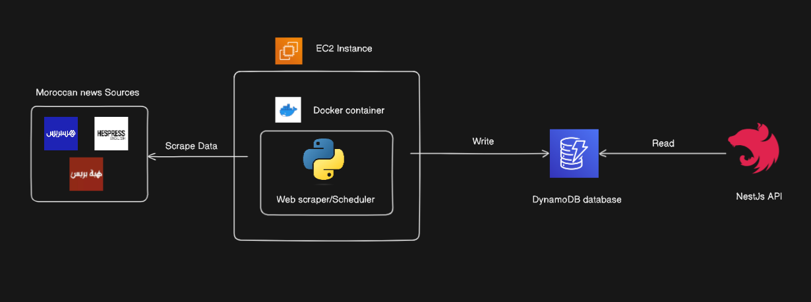

# Moroccan News Aggregator

A Moroccan News Scraper project built with Python for web scraping, storing data in a relational database, and utilizing NestJS for API development. The scraper operates daily to collect news articles from diverse Moroccan news sources, persisting them in a database for convenient access. Through NestJS, the API furnishes endpoints enabling querying and retrieval of the scraped news data. This endeavor was crafted to delve into web scraping methodologies, database management, and API construction, with an emphasis on functionality over responsiveness.

## 📦 Technologies

- `Python`
- `BeautifulSoup`
- `Selenium`
- `DynamoDB`
- `EC2`
- `Docker`
- `NestJS`

### API Endpoints
| HTTP Verbs | Endpoints | Action |
| --- | --- | --- |
| GET | /news/ | To get All news |
| GET | /users/:source | To get news by source |

## 👩🏽‍🍳 The Process

I embarked on the creation of the Moroccan News Scraper project by identifying the target Moroccan news websites for data extraction. Leveraging Python's web scraping libraries, such as BeautifulSoup or Scrapy, I developed a web scraper capable of extracting news articles' information from the selected websites. This web scraper was containerized using Docker for portability and ease of deployment.

Subsequently, I chose Amazon DynamoDB as the database solution to store the scraped data. DynamoDB's flexibility and scalability made it a suitable choice for handling the dynamic nature of news articles. I designed the database schema to accommodate the necessary fields for storing details such as title, link, publication date, and source.

For hosting the web scraper, I provisioned an Amazon EC2 instance and deployed the Docker container containing the scraper onto the instance. This EC2 instance served as the computing environment for running the containerized web scraper, ensuring reliable and scalable performance.

Simultaneously, I utilized NestJS, a Node.js framework, to develop the API layer for the project. The NestJS application was designed to interact with DynamoDB, providing RESTful endpoints for querying and retrieving news articles' data. These endpoints facilitated seamless access to the scraped data, enabling users to query based on criteria such as source.

Throughout the development process, I meticulously documented the project's evolution, including the steps taken, challenges encountered, and lessons learned. This documentation served as a valuable resource for understanding the project's architecture and implementation details.

In summary, the Moroccan News Scraper project utilized a Docker containerized web scraper hosted on an Amazon EC2 instance, with data stored in Amazon DynamoDB. The project's API layer was developed with NestJS, providing seamless access to the scraped data through RESTful endpoints.

